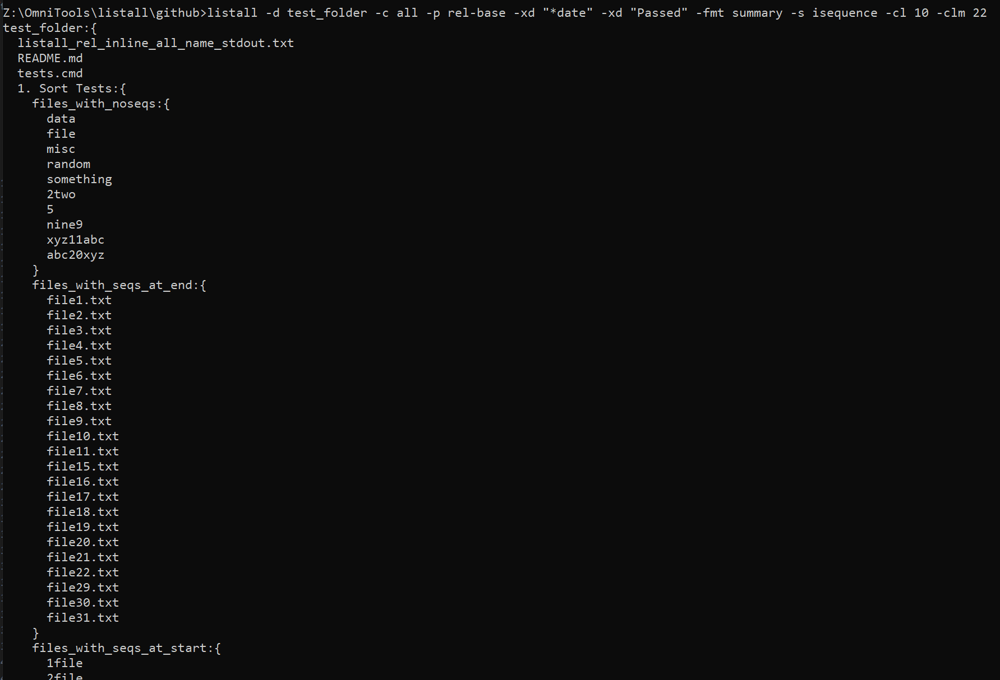

# listall.py

`listall.py` is a Python command-line tool for listing directory structures, sorting files by various criteria, truncating large directories, collecting only directories or files, generating compact JSONish hierarchical summaries, and much more. It’s designed to be a flexible, scriptable alternative to basic `dir` or `ls` commands, offering deeper control and formatting options.



---

## Features

- **Multiple Sort Modes**  
  - `sequence` / `isequence`: numeric + text, case-sensitive or case-insensitive  
  - `winsequence`: attempts to emulate Windows Explorer underscore sorting  & case-insensitivity
  - `name` / `iname`: alphabetical, case-sensitive or case-insensitive  
  - `date`: sort by last modification time  

- **Collection Strategies**  
  - `all`: list everything  
  - `dirs-only`: list directories only  
  - `dirs-1st-last-file`: pick first and last file per directory  
  - `files-only`: list just files, optionally in hierarchical braces in summary mode  

- **Path Styles**  
  - `full`: absolute paths  
  - `rel`: relative to the starting directory  
  - `rel-base`: same as `rel` but forced to include the top-level folder name  
  - `files-only`: show only filenames (with special braces logic in summary mode)  

- **Formatted Output**  
  - `inline`: print files or directories line-by-line  
  - `summary`: hierarchical braces indicating subdirectories  
  - Optional `--compact-braces`: close braces on the same line  
  - Optional indentation control via `--indent`  

- **Partial Truncation**  
  - `--collect-limit` + `--collect-limit-min`: if a directory has too many files, show only the first few and last few.  

- **Exclude Patterns**  
  - `--exclude` / `-xd`: skip certain files/folders matching patterns (e.g., `*.txt`, `_Calibre (By Author)`)  

- **System Decorators**  
  - `--decorator unix` => convert `\` to `/`  
  - `--decorator windows` => convert `/` to `\`  
  - `--decorator rel-leader`, `--decorator no-leader` => control leading `./` or `.\`  

- **Cross-Drive Strictness**  
  - `--strict-rel`: raise an error if you try to produce relative paths across different drives.  

- **User Hooks/Stubs for Partial Skips**  
  - (Optional) internal logic that can skip subdirectories or store only first+last if a directory is huge (via `--max-depth`, `--prune-large-dirs`, or a future user callback).  

---

## Installation

### Option 1: Direct Download / Copy

Simply download or copy `listall.py` into a folder on your system. You can then run:

```bash
python listall.py --help
```

or make it executable on Unix-like systems:

```bash
chmod +x listall.py
./listall.py --help
```

### Option 2: pip install

This install listall.py into your Python environment:

```bash
pip install git+https://github.com/djdarcy/listall.git
```

Or if you want to install it locally in editable mode for debugging:

```bash
pip install -e .
```

### Option 3: Symlink

Alternatively, symlink `listall.py` into `/usr/local/bin` (on macOS/Linux):

```bash
pip install git+https://github.com/djdarcy/listall.git
```

Then invoke `listall` from anywhere.

## Usage Examples

```bash
# Basic usage: List everything from current dir, sorted by name, copying output to clipboard:
listall.py -d . -s name --output clip

# Show directories only, in an inline listing, relative paths:
listall.py -d /some/path -c dirs-only -p rel -fmt inline

# Summaries, force them to be hierarchical braces, with 'winsequence' sorting:
listall.py -d . -fmt summary -c all -s winsequence
```

### Some Additional Examples

```bash
# If you want to show partial truncation of big directories:
listall.py -d /my/huge/folder --collect-limit 10 --collect-limit-min 4

# Show only first/last file in each directory, in a hierarchical summary:
listall.py -d . --collect dirs-1st-last-file --format summary

# Make paths consistent with Windows (using backslashes):
listall.py -d . --decorator windows

# Restrict search depth to 3 sublevels:
listall.py -d . --max-depth 3 -fmt summary -c all
```

For full reference, run:

```bash
listall.py --help
```

Or for extended info on certain parameters:

```bash
listall.py --help path-style
listall.py --help sort
```

## Roadmap / Future Ideas

**Config Files**: Possibly allow users to store common arguments (`--path-style rel-base`, `--decorator windows`, etc.) in a YAML, TOML, or JSON config.

**User Hooks**: Richer “partial skip” or “max-depth” logic letting you skip subtrees dynamically, or define custom logic on a per-directory basis.

**PyPI Release**: Convert to a standard Python package for direct `pip install listall`.

**Performance**: For extremely large directories, we might optimize calls to `os.stat`.

## Contributing

Issues, suggestions, and bug reports are all welcome. Please open an [issue](https://github.com/djdarcy/listall/issues) if you find something that can be improved. Or fork the repo, make changes (ideally with tests), and open a PR with the feature or bugfix.

Like the project? 

[](https://www.buymeacoffee.com/djdarcy)

## License

listall.py
Copyright (C) 2025 Dustin Darcy

This program is free software: you can redistribute it and/or modify
it under the terms of the GNU General Public License as published by
the Free Software Foundation, either version 3 of the License, or
(at your option) any later version.

This program is distributed in the hope that it will be useful,
but WITHOUT ANY WARRANTY; without even the implied warranty of
MERCHANTABILITY or FITNESS FOR A PARTICULAR PURPOSE.  See the
GNU General Public License for more details.

You should have received a copy of the GNU General Public License
along with this program.  If not, see <http://www.gnu.org/licenses/>.
